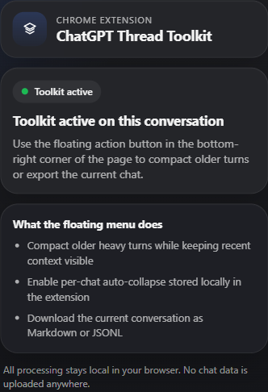

# ChatGPT Thread Toolkit

ChatGPT Thread Toolkit is a Chrome extension for keeping long `chatgpt.com` conversations responsive. It adds a compact floating action button inside the thread so you can collapse heavy older turns and export the active conversation without leaving the page.

The original userscript is still included in this repository as a legacy/reference artifact, but the extension is now the primary install path.

## Features

- Compact older heavy turns while keeping recent context visible.
- Enable auto-collapse for a specific chat URL without affecting other chats.
- Export the entire current conversation to a `.md` file.
- Export the entire current conversation to a `.jsonl` file with only `role` and `text` per message.
- Preserve export access even after older messages were compacted.
- Keep the interface lightweight with a small bottom-right action menu and a minimal toolbar popup.

## Install The Chrome Extension

### Load unpacked

1. Open Chrome and go to `chrome://extensions`.
2. Enable `Developer mode`.
3. Click `Load unpacked`.
4. Select the [`extension`](./extension) folder from this repository.
5. Open `https://chatgpt.com` and use the floating action button inside a conversation.

### Package for distribution

Run the packaging script from the repository root:

```powershell
pwsh -File scripts/package-extension.ps1
```

The script creates a Chrome Web Store upload zip in `output/` with the extension payload at the zip root.

## Toolbar Popup

The extension action opens a minimal popup that:

- confirms whether the current tab is a supported ChatGPT conversation,
- summarizes the available thread actions,
- links unsupported tabs back to `chatgpt.com`.

The actual controls stay in the floating in-page menu.

## Usage

The floating action button appears in the bottom-right corner of supported ChatGPT conversation views.

- `Compact Older`: collapses older large messages and keeps the latest turns expanded.
- `Auto-collapse here`: stores the current chat URL path in extension storage and automatically compacts older messages only in that chat.
- `Download .md`: exports the current conversation from first message to last message as Markdown.
- `Download .jsonl`: exports one JSON object per line with only `role` and `text`.
- `Expand`: appears inside each collapsed message so you can restore it in place.

## Screenshots

In-page action menu:


Toolbar popup:



## Privacy

- All processing happens locally in the browser.
- The extension does not send conversation data to any external service.
- Per-chat auto-collapse preferences are stored in `chrome.storage.local`.
- Markdown and JSONL exports are generated locally and downloaded directly by the browser.

The full privacy statement for store submission is in [`docs/extension-privacy.md`](./docs/extension-privacy.md).

## Legacy Userscript

The previous userscript remains available at [`chatgpt-thread-toolkit.user.js`](./chatgpt-thread-toolkit.user.js) for users who still prefer Tampermonkey or a source-only install. It now includes a runtime guard so it does not try to run alongside the extension on the same page.

## Store Submission Notes

Chrome Web Store listing copy, permission justifications, and screenshot references live in [`docs/chrome-web-store.md`](./docs/chrome-web-store.md).

## Validation

This repository validates:

```bash
node --check chatgpt-thread-toolkit.user.js
node --check extension/content.js
node --check extension/popup.js
```

and packages the extension zip in CI using [`scripts/package-extension.ps1`](./scripts/package-extension.ps1).

## License

Released under the MIT License. See [`LICENSE`](./LICENSE).

## Roadmap

- Improve Markdown fidelity for math-heavy threads.
- Add continuation-pack export for starting fresh threads with preserved context.
- Add optional restore-all and focus-mode actions.
