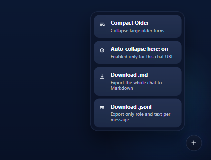

# ChatGPT Thread Toolkit

ChatGPT Thread Toolkit is a focused userscript for keeping long `chatgpt.com` conversations usable. It adds a small floating action button with quick thread actions that reduce UI lag and let you export the full conversation as Markdown or JSONL.

## Features

- Compact older heavy turns while keeping recent context visible.
- Enable auto-collapse for a specific chat URL without affecting other chats.
- Export the entire current conversation to a `.md` file.
- Export the entire current conversation to a `.jsonl` file with only `role` and `text` per message.
- Preserve export access even after older messages were compacted.
- Keep the interface lightweight with a small bottom-right action menu.

## Installation

1. Install [Tampermonkey](https://www.tampermonkey.net/) in your browser.
2. Open [`chatgpt-thread-toolkit.user.js`](./chatgpt-thread-toolkit.user.js) from this repository.
3. Create a new Tampermonkey script and paste the file contents, or use Tampermonkey's install flow from the raw file view in GitHub.
4. Save the script and reload `https://chatgpt.com`.

## Usage

The script injects a floating action button in the bottom-right corner of the ChatGPT thread view.

- `Compact Older`: collapses older large messages and keeps the latest turns expanded.
- `Auto-collapse here`: stores the current chat URL in local settings and automatically compacts older messages only in that chat.
- `Download .md`: exports the current conversation from first message to last message as Markdown.
- `Download .jsonl`: exports one JSON object per line with only `role` and `text`.
- `Expand`: appears inside each collapsed message so you can restore it in place.

## Screenshot



## Privacy

- All processing happens in the page context inside your browser.
- The script does not send conversation data to any external service.
- Per-chat auto-collapse preferences are stored locally in your browser via `localStorage`.
- The Markdown export is generated locally and downloaded directly by the browser.

## Limitations

- ChatGPT changes its DOM structure regularly, so selectors may need updates over time.
- Markdown export is best-effort for rich content such as formulas, tables, and complex embedded UI blocks.
- JSONL export is intentionally narrow and only stores `role` and extracted message text.
- Auto-collapse is keyed to the chat URL path, so copied or regenerated chats are treated as separate threads.
- The script currently targets `chatgpt.com` and `chat.openai.com` conversation pages only.

## Validation

This repository includes a minimal GitHub Actions workflow that validates the userscript syntax with:

```bash
node --check chatgpt-thread-toolkit.user.js
```

## License

Released under the MIT License. See [`LICENSE`](./LICENSE).

## Roadmap

- Improve Markdown fidelity for math-heavy threads.
- Add continuation-pack export for starting fresh threads with preserved context.
- Add optional restore-all and focus-mode actions.
